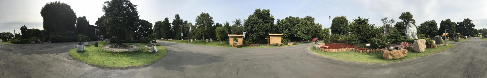

# Panoroma Creator
## Environment: 
- MATLAB R2017b

## Execution: 
- Main program
  - main.m 
## Resource Files: 
- Original Photo Sets:  imageset/
- Panoroma output directory:  result/
## Prerequisite
- Resize your photos(for faster processing speed) and use [autostitch](http://matthewalunbrown.com/autostitch/autostitch.html) to find the focal length for each photo.
- Change the focal_length array
```
% main.m

% focal length for each photo stores here
focal_length = [
    ...
];
```

## Details of Execution

Execute main.m will do the following processes.

### 1. Read Images

### 2. Warping

Warp each image to cylindrical coordinate.

### 3. Feature Extraction

- Using techniques:
  - Multi-Scale Harris corner detector
  - Adaptive Non-maximal suppression(one should set their desired num of interest points)
  ```desired_numOfInterestPt = 1000;```
  - Sample 8x8 oriented patches as feature descriptor
  
### 4. Feature Matching

- Exhaustively calculate Euclidean distance between all features in two images.
- Find the smallest 2 pairs(by sorting first), say e1-nn and e2-nn are distance of the two pairs.
- Consider the smallest pair as feature match if the ratio e1-nn / e2-nn are lower than a threshold value.
- The threshold can be set at:
```
% main.m

nearestneighbor_threshold = 0.7;
```
- Reference to 5.1 section of paper [Brown, Szeliski, Winder, CVPR'2005]

### 5. Image Matching

- With RANSAC Approach

### 6. Combine Image and Blending
- Stitch images from leftmost to rightmost ones
- Use linear blending on overlapping sections


## Result

